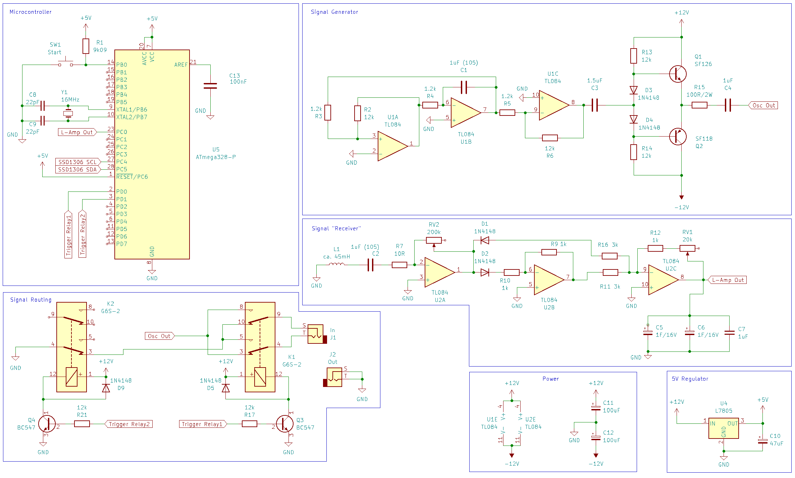

# CABLESHIELDTESTINATOR

Recently a [post](https://www.instagram.com/audio.pilz/p/CvVS7SXtaue/) by [AudioPilz](https://www.youtube.com/@AudioPilz) from a while ago inspired me to build a device that non-invasively detects whether a cable is actually shielded or not. From an economic point of view this device makes absolutely no sense. It was a just-for-fun project to find out whether it can be done or not. Once again I learned a lot.

Cheap audio patch cables often come unshielded today. That means that the second conductor (ground, the shield) is not a mesh of wires wrapped around the signal conductor (as I would expect it from cables for audio). Instead there are just two wires lying next to each other inside the coating. So I was eager to find out whether a cable is shielded or not without cutting it. 

If you like my work and want to contact me for hardware or software related projects, head over to https://seige.digital

## The Idea

The idea was to lay the cable through a coil, run a signal through to both of the conductors alternating and measure the response that gets induced in the coil. 

A cable with two equal conductors (unshielded) should behave different from a cable where one conductor is wrapped around the other one (shielded).

It turned out that this approach oviously was good enough to separate shielded cables from unshielded ones.

## Circuit Diagram

The Cicruit uses a TL084 as an oscillator to generate a triangular waveform at about 250 Hz. An ATMEGA328p microcontroller uses two relays to pass this signal through this or that wire. The cable under test is placed inside a coil. The coil itself is connected to another TL084 to amplify and smooth the signal. Finally, the microcontroller reads the analog signal and evaluates it.

## The Code

The microcontroller rotates through the four possible states of the two relais and measures the voltage received by the coil. Larger differences between the four options indicate a shielded cable, similar values indicate an unshielded cable.

## The Case

I designed the case myself and printed it with my own 3D printer. I used recycled filament from [Recycle Fabrik](https://recyclingfabrik.com) in order to help avoiding plastic waste.

